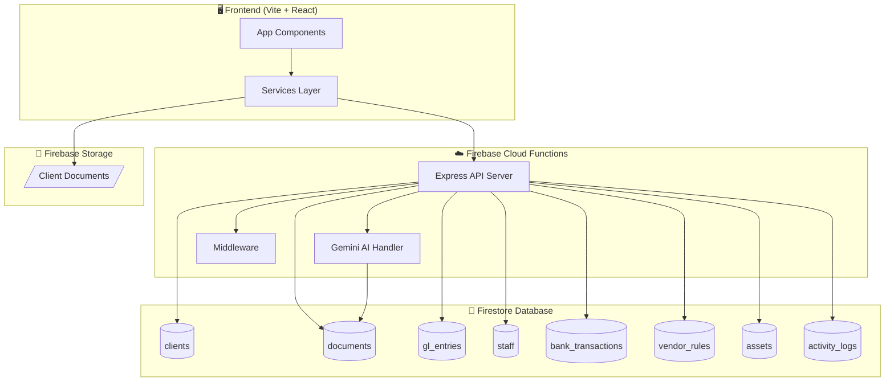
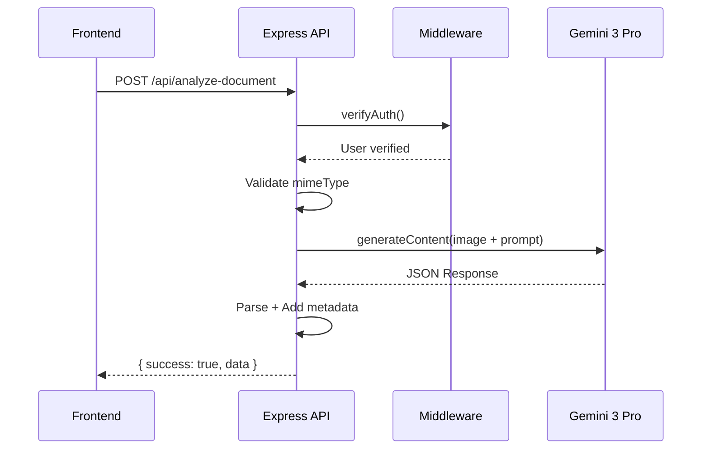
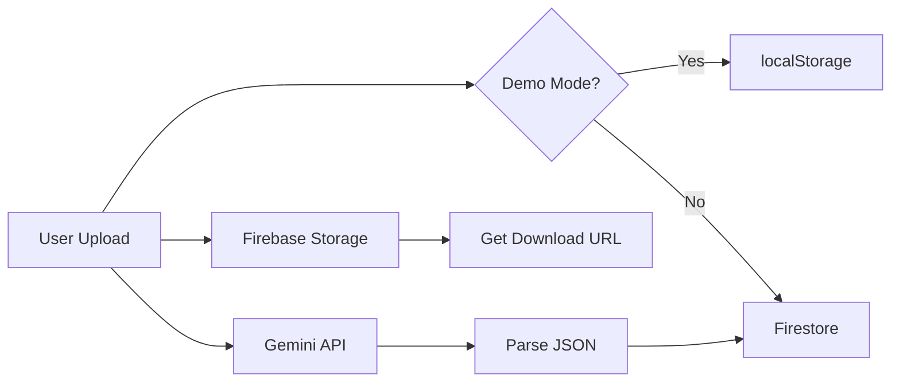

# 🗄️ WE Accounting & Tax AI
## Database & Backend Architecture Analysis

> **Generated:** 2025-12-15  
> **Purpose:** ตรวจสอบ Database และ Backend อย่างละเอียด

---

# 📊 System Architecture Overview



---

# 1️⃣ Database Layer

## 1.1 Firebase Configuration

**File:** `services/firebase.ts`

```typescript
// ตรวจจาก Environment Variables (VITE_ prefix)
const firebaseConfig = {
  apiKey: import.meta.env.VITE_FIREBASE_API_KEY,
  authDomain: import.meta.env.VITE_FIREBASE_AUTH_DOMAIN,
  projectId: import.meta.env.VITE_FIREBASE_PROJECT_ID,
  storageBucket: import.meta.env.VITE_FIREBASE_STORAGE_BUCKET,
  messagingSenderId: import.meta.env.VITE_FIREBASE_MESSAGING_SENDER_ID,
  appId: import.meta.env.VITE_FIREBASE_APP_ID
};
```

### Mode Detection:
```typescript
export const isFirebaseConfigured = !!(
  firebaseConfig.apiKey && firebaseConfig.apiKey.length > 0 &&
  firebaseConfig.projectId && firebaseConfig.projectId.length > 0
);

// ถ้าไม่มี config → Demo Mode
const IS_DEMO_MODE = !isFirebaseConfigured;
```

| Mode | Storage | Persistence |
|------|---------|-------------|
| **Demo Mode** | localStorage | Browser only |
| **Production** | Firestore | Cloud |

---

## 1.2 Collections (Tables)

**File:** `services/database.ts`

| Collection | Purpose | Key Fields |
|------------|---------|------------|
| `clients` | ข้อมูลลูกค้า | id, name, tax_id, status, current_workflow |
| `documents` | เอกสารที่ upload | id, clientId, filename, status, ai_data, year, month, period |
| `gl_entries` | รายการบัญชี GL | id, clientId, date, account_code, debit, credit, year, month |
| `staff` | พนักงาน | id, name, email, role, assigned_clients |
| `bank_transactions` | รายการธนาคาร | id, clientId, date, amount, description, status |
| `vendor_rules` | กฎ Auto-mapping | id, clientId, vendor_pattern, default_account |
| `assets` | สินทรัพย์ถาวร | id, clientId, name, purchase_date, value |
| `activity_logs` | Log กิจกรรม | id, timestamp, action, collection, document_id |

---

## 1.3 CRUD Operations

### Pattern: Dual Mode Support

ทุก function รองรับทั้ง Demo Mode และ Production Mode:

```typescript
export const getDocuments = async (): Promise<DocumentRecord[]> => {
    if (IS_DEMO_MODE || !db) {
        // Demo Mode: ดึงจาก localStorage
        const data = getLocalStorage();
        return data.documents;
    }

    // Production Mode: ดึงจาก Firestore
    try {
        const q = query(collection(db, 'documents'), orderBy('uploaded_at', 'desc'));
        const snapshot = await getDocs(q);
        return snapshot.docs.map(doc => ({ id: doc.id, ...doc.data() }));
    } catch (error) {
        throw new Error('Failed to fetch documents');
    }
};
```

### Available Functions by Entity:

| Entity | Get All | Get By ID | Get By Client | Add | Update | Delete | Batch |
|--------|---------|-----------|---------------|-----|--------|--------|-------|
| clients | ✅ | ✅ | - | ✅ | ✅ | ❌ | ❌ |
| documents | ✅ | ❌ | ✅ | ✅ | ✅ | ✅ | ✅ |
| staff | ✅ | ✅ | - | ❌ | ✅ | ❌ | ❌ |
| gl_entries | ✅ | ❌ | ✅ | ✅ | ❌ | ❌ | ✅ |
| assets | ✅ | ❌ | ✅ | ✅ | ✅ | ❌ | ❌ |
| vendor_rules | ✅ | ❌ | ✅ | ✅ | ❌ | ✅ | ❌ |
| bank_transactions | ✅ | ❌ | ✅ | ✅ (batch) | ✅ | ❌ | ✅ |
| activity_logs | ✅ | ❌ | ❌ | ✅ | ❌ | ❌ | ❌ |

---

## 1.4 GL Entry Validation

**File:** `services/accountingValidation.ts`

ก่อนบันทึก GL มี validation:

```typescript
export const addGLEntriesValidated = async (
    entries: PostedGLEntry[],
    clientId: string,
    userId: string,
    sourceDocId?: string
) => {
    // 1. Validate Balance (Debit = Credit)
    // 2. Validate Account Codes (ต้องอยู่ใน Chart of Accounts)
    // 3. Check Period Lock (ห้ามลงในงวดที่ปิดแล้ว)
    // 4. Check Duplicate (ไม่ลงซ้ำ)
    
    const validation = await validateGLPosting(request);
    
    if (!validation.isValid) {
        return { success: false, ids: [], validation };
    }
    
    const ids = await addGLEntries(entries);
    return { success: true, ids, validation };
};
```

---

# 2️⃣ Backend Layer (Cloud Functions)

## 2.1 Structure

```
functions/
├── src/
│   ├── index.ts      # Main Express app + Firestore triggers
│   ├── gemini.ts     # AI OCR handler
│   └── middleware.ts # Auth + RBAC
├── package.json
└── tsconfig.json
```

---

## 2.2 Express API Server

**File:** `functions/src/index.ts`

### Security Features:

| Feature | Implementation | Config |
|---------|----------------|--------|
| **Helmet** | Security headers | CSP, CORS policies |
| **CORS** | Origin whitelist | localhost:5173, web.app |
| **Rate Limit (Global)** | 100 req/min/IP | express-rate-limit |
| **Rate Limit (Analysis)** | 20 req/min/user | Stricter for AI |
| **Body Size** | 15MB limit | For Base64 images |
| **Request Logging** | Auto log all requests | Duration + status |

### API Endpoints:

| Method | Endpoint | Auth | Rate Limit | Purpose |
|--------|----------|------|------------|---------|
| GET | `/health` | ❌ | Global | Health check |
| POST | `/api/analyze-document` | ✅ | 20/min | AI OCR analysis |
| GET | `/api/admin/users` | ✅ Admin | Global | List users |
| POST | `/api/clients` | ✅ Manager | Global | Create client |
| GET | `/api/clients/:clientId` | ✅ + Access | Global | Get client |
| GET | `/api/clients/:clientId/documents` | ✅ + Access | Global | Get client docs |
| POST | `/api/logs` | ❌ | Global | Client-side logging |

### Middleware Chain:

```
Request → Helmet → CORS → Rate Limit → Body Parser → Logger
       → [verifyAuth] → [checkRole] → [checkClientAccess]
       → Handler → Response
```

---

## 2.3 AI OCR Handler (Gemini 3 Pro)

**File:** `functions/src/gemini.ts`

### Flow:



### Configuration:

```typescript
const model = genAI.getGenerativeModel({
  model: "gemini-3-pro-preview",  // Latest model
  systemInstruction: SYSTEM_PROMPT,
  generationConfig: {
    temperature: 0.1,  // Low for consistency
    responseMimeType: "application/json",
  },
});
```

### System Prompt (Thai Accounting Rules):

| Rule | Detail |
|------|--------|
| WHT Rates | 1% ขนส่ง, 2% โฆษณา, 3% บริการ, 5% เช่า |
| VAT | ตรวจใบกำกับภาษีเต็ม vs ย่อ |
| Form Types | ภ.ง.ด.3 (บุคคล), ภ.ง.ด.53 (นิติบุคคล) |
| Chart of Accounts | Standard Thai COA (11100-53000) |

---

## 2.4 Firestore Triggers (Audit Trail)

**Automatic logging ทุกครั้งที่มีการเปลี่ยนแปลงข้อมูล:**

| Trigger | Action Logged |
|---------|---------------|
| `onCreate` | CREATE + data preview |
| `onUpdate` | UPDATE + before/after diff |
| `onDelete` | DELETE + document_id |

```typescript
export const onDocumentCreated = functions
  .firestore.document("{collection}/{docId}")
  .onCreate(async (snap, context) => {
    // Skip activity_logs to prevent infinite loop
    if (collection === "activity_logs") return;
    
    await admin.firestore().collection("activity_logs").add({
      timestamp: serverTimestamp(),
      action: "CREATE",
      collection,
      document_id: docId,
      data_preview: JSON.stringify(snap.data()).substring(0, 500),
    });
  });
```

---

## 2.5 Scheduled Functions

| Function | Schedule | Purpose |
|----------|----------|---------|
| `dailyReportGeneration` | 6 AM Bangkok | Count docs, approved, pending |
| `weeklyLogCleanup` | Sunday 2 AM | Archive logs > 90 days |

---

# 3️⃣ Data Flow Diagrams

## 3.1 Document Upload Flow



## 3.2 Multi-Tenant Query Pattern

```typescript
// ทุก query ต้องมี clientId filter
const getDocumentsByClient = async (clientId: string) => {
    return fetchCollection(
        'documents',
        [where('clientId', '==', clientId), orderBy('uploaded_at', 'desc')]
    );
};

// Period-based queries (เพิ่มใหม่)
const getDocumentsByPeriod = async (clientId: string, year: number, month: string) => {
    return fetchCollection(
        'documents',
        [
            where('clientId', '==', clientId),
            where('year', '==', year),
            where('month', '==', month)
        ]
    );
};
```

---

# 4️⃣ Security Analysis

## 4.1 Current Security Measures

| Layer | Measure | Status |
|-------|---------|--------|
| **API** | Firebase Auth verification | ✅ Active |
| **API** | Role-based access (admin, manager) | ✅ Active |
| **API** | Client access control | ✅ Active |
| **API** | Rate limiting | ✅ Active |
| **Headers** | Helmet security headers | ✅ Active |
| **Firestore** | Security Rules | ⚠️ Need Config |
| **Storage** | Storage Rules | ⚠️ Need Config |

## 4.2 Missing Security (Need to Configure)

### Firestore Rules (firestore.rules):
```firestore
rules_version = '2';
service cloud.firestore {
  match /databases/{database}/documents {
    // Only authenticated users
    match /clients/{clientId} {
      allow read: if request.auth != null;
      allow write: if request.auth.token.role in ['admin', 'manager'];
    }
    
    // Documents scoped to client
    match /documents/{docId} {
      allow read: if request.auth != null && 
        resource.data.clientId in request.auth.token.assigned_clients;
    }
  }
}
```

### Storage Rules (storage.rules):
```firestore
rules_version = '2';
service firebase.storage {
  match /b/{bucket}/o {
    match /clients/{clientId}/documents/{allPaths=**} {
      allow read, write: if request.auth != null &&
        clientId in request.auth.token.assigned_clients;
    }
  }
}
```

---

# 5️⃣ Performance Analysis

## 5.1 Current Indexes

**File:** `firestore.indexes.json` (เพิ่งสร้าง)

| Collection | Index Fields | Purpose |
|------------|--------------|---------|
| documents | clientId + year + month + uploaded_at | Period queries |
| documents | clientId + period + uploaded_at | Monthly view |
| documents | clientId + status + uploaded_at | Status filter |
| gl_entries | clientId + year + month + date | GL by period |
| gl_entries | clientId + account_code + date | Account query |
| bank_transactions | clientId + year + month + date | Bank by period |
| tasks | clientId + assignee_id + status + due_date | Task queries |

## 5.2 Optimization Recommendations

| Current | Issue | Recommended |
|---------|-------|-------------|
| Flat collections | Slow at scale | Subcollections |
| No caching | Repeat queries | React Query |
| Large components | Slow load | Lazy loading |
| No pagination | Memory issues | Cursor pagination |

---

# 6️⃣ Gap Analysis

## 6.1 Missing Features

| Feature | Priority | Effort |
|---------|----------|--------|
| Soft Delete | Medium | 2 hrs |
| Data Archival | Low | 4 hrs |
| Full-text Search | Medium | 8 hrs |
| Export to Excel | Medium | 4 hrs |
| Backup/Restore | High | 8 hrs |

## 6.2 Inconsistencies Found

| Issue | Location | Fix |
|-------|----------|-----|
| `client_id` vs `clientId` | getDocumentsByClient | Standardize to `clientId` |
| Missing `addStaff` function | database.ts | Add function |
| Missing `deleteClient` function | database.ts | Add function |
| `processed_by` says "gemini-1.5-pro" | gemini.ts line 116 | Update to "gemini-3-pro" |

---

# 7️⃣ Summary

## Current Status

| Component | Status | Readiness |
|-----------|--------|-----------|
| **Frontend Database Service** | ✅ Complete | 90% |
| **Cloud Functions API** | ✅ Complete | 85% |
| **Gemini AI Integration** | ✅ Complete | 90% |
| **Firestore Triggers** | ✅ Complete | 95% |
| **Scheduled Jobs** | ✅ Complete | 90% |
| **Security Rules** | ⚠️ Needs Config | 50% |
| **Composite Indexes** | ✅ Defined | 80% |

## Deployment Checklist

- [ ] Set Gemini API key: `firebase functions:config:set gemini.api_key="YOUR_KEY"`
- [ ] Deploy Firestore rules: `firebase deploy --only firestore:rules`
- [ ] Deploy Storage rules: `firebase deploy --only storage:rules`
- [ ] Deploy indexes: `firebase deploy --only firestore:indexes`
- [ ] Deploy functions: `firebase deploy --only functions`
- [ ] Set environment variables in `.env`

---

*Document generated by Antigravity AI Assistant*
